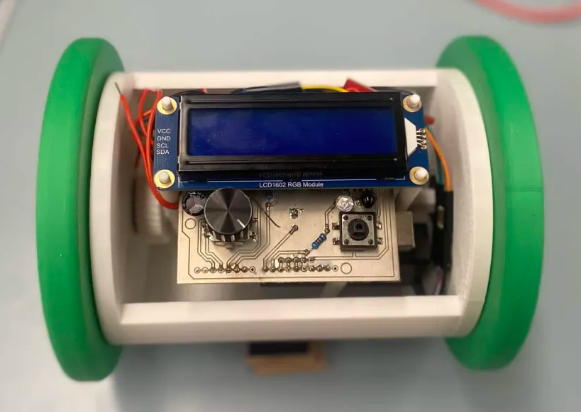
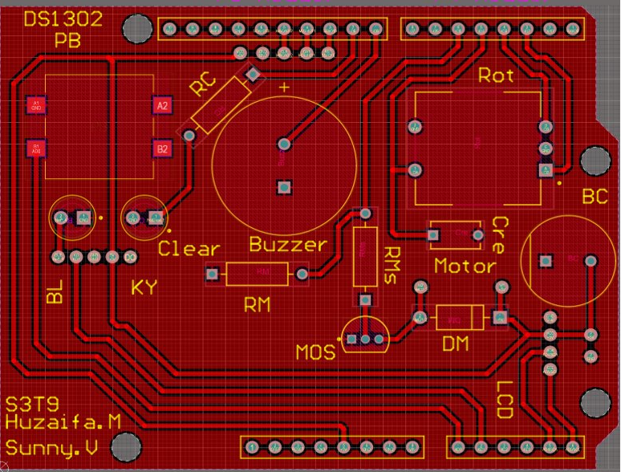

# Alarmy

An Arduino-based running alarm clock that combines standard alarm clock functionality with motion, proximity sensing, and embedded UI design.

Alarmy was built as an embedded design project with the goal of making alarms harder to ignore. The system keeps real time using a DS1302 RTC, allows the user to set the clock and alarm through a rotary encoder and buttons, stores alarm settings in EEPROM, drives a buzzer and motor for alarm output, and uses an IR emitter and photodiode sensing setup for proximity detection.

## Features

- Real-time clock using a **DS1302 RTC**
- 16x2 **Waveshare RGB LCD** interface
- **KY-040 rotary encoder** with pushbutton for editing values
- External pushbutton for mode changes and alarm dismissal
- **Weekday-based alarm scheduling**
- **EEPROM-backed alarm persistence**
- Passive buzzer alarm output
- N20 motor-based physical alarm actuation
- IR emitter and photodiode proximity sensing using an **LM393 comparator board**
- Interrupt-based rotary encoder handling with Gray-code decoding
- Optimized LCD updates to reduce flicker and improve responsiveness

## Repository Structure

```text
Alarmy/
├── media/      # Project photos / demo images
├── cad/        # Mechanical design files / 3D models
├── pcb/        # PCB design files
└── src/
    └── alarmy.ino
```

## Hardware

Current hardware used in the prototype:

- Arduino Uno
- DS1302 RTC module
- Waveshare RGB LCD1602
- KY-040 rotary encoder
- External pushbutton
- Passive buzzer
- N20 DC motor
- MOSFET motor driver
- Flyback diode
- IR emitter and photodiode
- KY-037 board repurposed for its onboard LM393 comparator
- 470 µF bulk capacitor for voltage sag protection
- 0.1 µF capacitor for pushbutton RC filtering
- NiMH battery supply

## How It Works

The firmware is organized around three main UI modes:

- `MODE_NORMAL`
- `MODE_SET_TIME`
- `MODE_SET_ALARM`

The user edits values using the rotary encoder and its pushbutton, while the external button is used for major mode transitions. The RTC is polled periodically, alarm settings are stored in EEPROM, and the LCD only redraws changed characters to reduce flicker. The alarm logic supports weekday selection through a 7-bit day mask, and the buzzer uses a non-blocking repeating beep pattern. The motor output is also integrated into the alarm behavior.

## Pin Summary

From the current firmware:

- `pinA = 2`
- `pinB = 3`
- `buttonPin = A0`
- `rotButtonPin = 4`
- `buzzer = 8`
- `emitterPin = 9`
- `sensorPin = A1`
- `motorPin = 5`

RTC pins:

- `CE = 10`
- `IO = 11`
- `SCLK = 12`

## Software Notes

A few implementation details that matter:

- Rotary encoder input is handled using **interrupts**
- Encoder transitions are decoded using a **Gray-code transition table**
- Alarm settings are stored in EEPROM using a **versioned structure**
- LCD updates are throttled and diff-based to improve responsiveness
- Proximity detection compares emitter-off and emitter-on readings rather than relying on a single absolute measurement

## Building / Uploading

1. Open `src/alarmy.ino` in the Arduino IDE.
2. Install the required libraries:
   - `DS1302`
   - `EEPROM` (built-in)
   - `Waveshare_LCD1602_RGB`
3. Select the correct board and port for your Arduino.
4. Upload the sketch.
5. Connect the hardware according to the pin assignments above.

## CAD and PCB

- The `cad/` folder contains the mechanical design files for the enclosure and body.
- The `pcb/` folder contains the board design files as the electronics become more integrated.

The long-term goal is to move away from multiple header-connected external modules and toward a more compact PCB with more of the support circuitry integrated directly on-board.


## Media

Prototype photo:



PCB screenshot:


